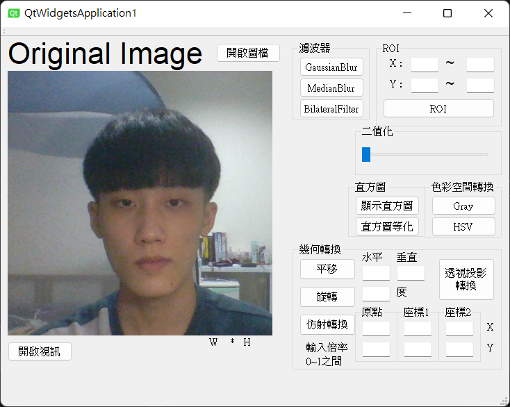

# **數位影像處理概論 - 作業3：影像處理程式開發平台3**
### 新增功能 : 開啟視訊鏡頭，並放入QLabel物件

### 預計新增功能 : 人臉偵測 : 利用別人做好的模型 Haar Cascade 或 dlib 來實作
    https://github.com/opencv/opencv/tree/master/data/haarcascades
    http://dlib.net/
## 使用套件:
* OpenCV
* Qt
## 現有功能:
### 基礎功能
* 開啟圖檔
* ROI
### 色彩空間轉換
* 轉灰階
* 轉HSV
* 二值化
### 影像資訊
* 直方圖顯示
* 直方圖等化
### 鄰域處理
* 高斯平滑
* 中值平滑
### 幾何轉換
* 平移
* 旋轉
* 仿射轉換
* 透視投影轉換
