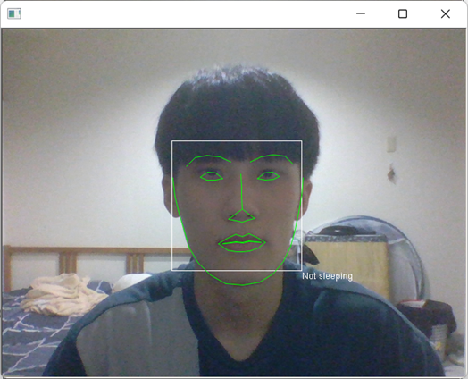
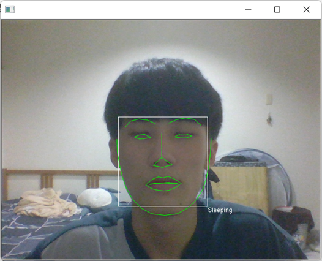

# **數位影像處理概論 - 睡意偵測 Drowsiness Detection**
## 軟體規格:
* Visual Studio 2022
* c++
## 使用套件:
* Qt : https://www.qt.io/
* OpenCV : https://opencv.org/
* dlib : http://dlib.net/
* 68個特徵點人臉偵測模型 : shape_predictor_68_face_landmarks.dat
## 前置作業: 安裝dlib(OpenCV同理)
1. 下載git
```
    https://git-scm.com/downloads
```
2. 使用git下載vcpkg
```
    git clone https://github.com/Microsoft/vcpkg.git
```
4. 建置vcpkg
```
    .\vcpkg\bootstrap-vcpkg.bat
```
5. 使用vcpkg安裝欲使用的函式庫, 這邊是安裝dlib, 進入vcpkg的目錄下,輸入
```
    vcpkg install dlib:x64-windows
```
6. 在Visual Studio裡使用vcpkg
```
    vcpkg integrate project
```
7. 之後會產生一段指令
```
Install-Package vcpkg.D.vcpkg -Source "D:\vcpkg\scripts\buildsystems"
```
step1 : 打開Visual Studio

step2 : 上方工具列->工具->Nuget套件管理員->套件管理器主控台

step3 : 輸入上方指令, 即可安裝完dlib
## 成果展示
**not sleeping**



**sleeping**


## 現有功能
### 基礎功能
* 開啟圖檔
* ROI
### 色彩空間轉換
* 轉灰階
* 轉HSV
* 二值化
### 影像資訊
* 直方圖顯示
* 直方圖等化
### 鄰域處理
* 高斯平滑
* 中值平滑
### 幾何轉換
* 平移
* 旋轉
* 仿射轉換
* 透視投影轉換
### 睡意偵測
## References
Realtime Driver Drowsiness Detection

    http://emaraic.com/blog/realtime-sleep-detection
基于opencv和shape_predictor_68_face_landmarks.dat的人脸识别监测

    https://blog.csdn.net/monster663/article/details/118341515
OpenCV - Norm() function

    https://docs.opencv.org/3.4/d2/de8/group__core__array.html#ga55a581f0accd8d990af775d378e7e46c
Class - dlib.image_window

    http://dlib.net/python/index.html#dlib_pybind11.image_window
